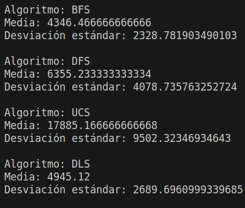
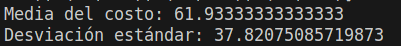

## Resultados Ejericio B TP3

    

## Resultados Ejericio B TP4

    

Podemos observar en los resultados como el algoritmo A* es mucho mas eficiente que el algoritmo de busqueda en profundidad y busqueda en profundiad limitada, ya que el algoritmo A* encuentra el camino optimo en todos los casos, mientras que el segundo no lo hace en ninguno. Esto se debe a que el algoritmo A* utiliza una heuristica que le permite encontrar el camino optimo, mientras que el algoritmo de busqueda en profundidad no utiliza ninguna heuristica y por lo tanto no encuentra el camino optimo.

Podemos observar tambien que el algoritmo A* es mucho mas eficiente que el algoritmo de busqueda en amplitud y el algoritmo de busqueda en costo uniforme, ya que el algoritmo A* encuentra el camino optimo en todos los casos, mientras que los otros no lo hace en ninguno. Esto se debe a que el algoritmo A* utiliza una heuristica que le permite encontrar el camino optimo, mientras que el algoritmo de busqueda en amplitud no utiliza ninguna heuristica y por lo tanto no encuentra el camino optimo.

A su vez, podemos observar en las imagenes como el algoritmo A* es mucho mas eficiente que el resto de algoritmos.

