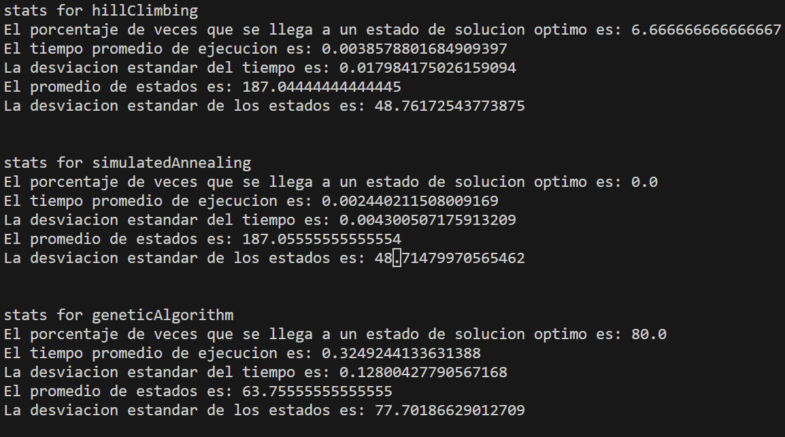
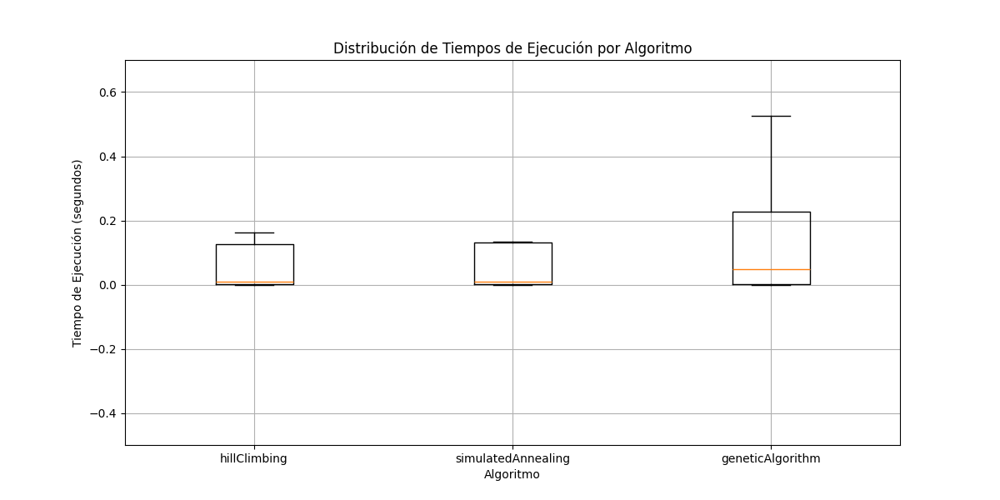
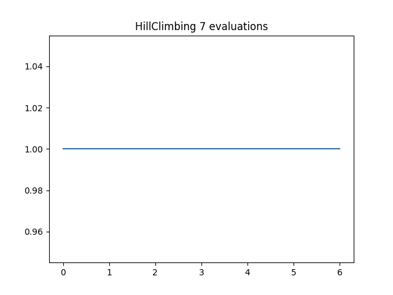
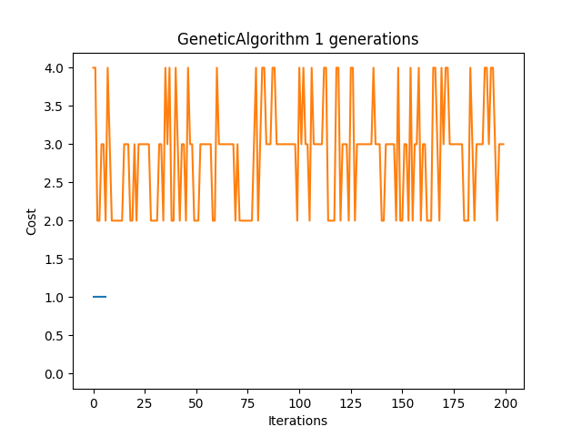

# Resultados tp5

## Apartado A

# Resultados de los algoritmos

# Boxplot de los algoritmos

## Apartado B

# Grafico de funcion HillClimbing

# Grafico de funcion simulatedAnnaling

# Grafico de funcion GeneticAlgorithm

## Apartado C

Considero que al estar buscando una solución correcta, los algoritmos genéticos son los más adecuados para esto, ya que comparado con hillclimbing y simulatedannaling tienen mucha mayor posibilidad de llegar a una solución. Hillclimbing es muy probable que se quede estancado en un máximo local y no pueda llegar a una solución óptima y simulatedannaling es quizás un poco más eficiente que hillclimbing, pero sigue sin ser óptimo

También podemos ver como es mucho más rápido un algoritmo genético a la hora de encontrar la solución viendo la diferencia entre el promedio de iteraciones, por lo tanto, a medida que el problema crece, estos son los más óptimos, sin embargo, cuando el problema crece, hay que tener en cuenta que los algoritmos genéticos ocupan mucho más almacenamiento en memoria, ya que debemos tener varios individuos en la población y esto podría traernos problemas si no tenemos memoria suficiente. Sin embargo, así todo, con el tamaño de nuestro problema de n reinas en el cual nuestro máximo es n=10, los algoritmos genéticos siguen siendo la mejor opción para implementar

