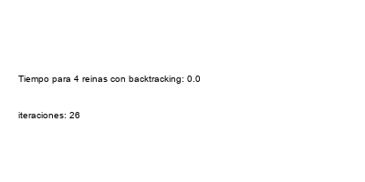
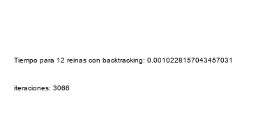
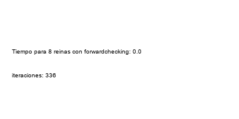
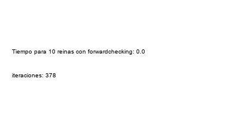

# Repuestas Ejericio 1
## 1- Describir en detalle una formulación CSP para el Sudoku

### Conjunto de variables
Cada celda del tablero de n*n es una variable

### Dominio de las variables
Números naturales del 1 al 9

### Restricciones

- Cada fila debe tener los números del 1 al 9 sin repetir: Para cada fila la suma total debe ser igual a 45

- Cada columna debe tener los números del 1 al 9 sin repetir: Para cada columna la suma total debe ser igual a 45

- El tablero del sudoku contiene cuadrados de 3*3 en los cuales cada cuadrado debe tener los numeros del 1 al 9 sin repetir: Para cada cuadrado la suma total debe ser igual a 45

### Solución

Podriamos aplicar cualquier algoritmo de CSP como por ejemplo forward checking.

# Repuestas Ejericio 2

## 2- Utilizar el algoritmo AC-3 para demostrar que la arco consistencia puede detectar la inconsistencia de la asignación parcial {WA=red, V=blue} para el problema del colorar el mapa de Australia (Figura 5.1 AIMA 2da edición ).

__Problema inicial__

cola = {(WA, NT), (WA, SA), (NT, WA), (NT, SA), (NT, Q), (SA, WA), (SA, NT), (SA, Q), (SA, NSW), (SA, V), (Q, NT), (Q, SA), (Q, NSW), (NSW, SA), (NSW, Q), (NSW, V), (V, SA), (V, NSW)}

__Asignacion parcial inicial {WA=red, V=blue}__

__Pirmera Iteracion__

Lo que quiere decir que el dominio es:

    WA: {rojo}

    NT: {verde, azul} Eliminamos rojo ya que WA es rojo

    SA: {verde} Eliminamos rojo y azul ya que WA es rojo y V es azul

    Q: {rojo, verde, azul}

    NSW: {rojo, verde} Eliminamos azul ya que V es azul

    V: {azul}

__Segunda Iteracion__

Ya que SA solo puede ser verde:

    WA: {rojo}

    NT: {azul} Eliminamos verde ya que SA es verde

    SA: {verde} 

    Q: {rojo, azul} Eliminamos verde ya que SA es verde

    NSW: {rojo} Eliminamos verde ya que SA es verde

    V: {azul}

__Tercer Iteracion__

Ya que NT solo puede ser azul:

    WA: {rojo}

    NT: {azul} 

    SA: {verde} 

    Q: {rojo} Eliminamos azul ya que NT es azul

    NSW: {rojo}

    V: {azul}

__Tercer Iteracion__

Ya que Q solo puede ser rojo:

    WA: {rojo}

    NT: {azul} 

    SA: {verde} 

    Q: {rojo} 

    NSW: {} Eliminamos rojo ya que Q es rojo

    V: {azul}

__Llegamos a la inconsistencia de que NSW no puede tomar ningun valor__

# Repuestas Ejericio 3

## 3- Cuál es la complejidad en el peor caso cuando se ejecuta AC-3 en un árbol estructurado CSP. (i.e. Cuando el grafo de restricciones forma un árbol: cualquiera dos variables están relacionadas por a lo sumo un camino).

La complejidad es O(n*d^2) donde:

    n es el numero de variables

    d es la maxima cantidad de valores en el dominio de cualquier variable
Al ser un arbol, porque los 2 vertices de un arista tiene d posibles variables

# Repuestas Ejericio 4

##  AC-3 coloca de nuevo en la cola todo arco (Xk, Xi) cuando cualquier valor es removido del dominio de Xi incluso si cada valor de Xk es consistente con los valores restantes de Xi. Supongamos que por  cada arco (Xk,Xi)  se puede llevar la cuenta del número de valores restantes de Xi que sean consistentes con cada valor de Xk . Explicar como actualizar ese número de manera eficiente y demostrar que la arco consistencia puede lograrse en un tiempo total O(n^2*d^2 )

Para hacerlo de manera eficiente, podriamos utilizar una matriz auxiliar:

    Con una fila para cada Xk

    Una columna para cada Xi

    Cada entrada m[i][j] representa la cantidad de restricciónes que son satisfechas

Para actualizar eficientemente esta matriz:

    1- Antes de comenzar AC3 creamos la matriz

    2- Cuando eliminamos valor v del dominio Xi, actualizamos:

        - Para cada valor u en Xk que es consistente con v, decrementamos m[u][v] en Esto refleja que ahora hay una restricción menos satisfecha para el par (u, v).

        - Si m[u][v] llega a cero , entonces sabemos que (u, v) ya no es consistente, y podemos eliminar u del dominio de Xk
    
    3- Después de eliminar valores del dominio de Xk o Xi, podemos verificar la consistencia de los arcos nuevamente utilizando la matriz de soporte 

La eficiencia en el peor de los casos es que debamos actualizar la matriz para cada valor en Xk y Xi, esto deriva en que la complejidad en el peor caso es de  O(n^2 * d^2).

# Repuestas Ejericio 5

## Demostrar la correctitud del algoritmo CSP para árboles estructurados (sección 5.4, p. 172 AIMA 2da edición).Para ello, demostrar:

### 1. Que para un CSP cuyo grafo de restricciones es un árbol, 2-consistencia (consistencia de arco) implica n-consistencia (siendo n el número total de variables).

Supongamos que tenemos un CSP con n variables y un grafo de restricciones que es un árbol. Queremos demostrar que si el CSP es 2-consistente, entonces es n-consistente.

Como supisimos que CSP es 2- consistente, va a existir un unico camino entre cualesquiera 2 variables Xi - Xj. Ese camino es P y esta compuesto por {Xi, X1, X2, ..., Xj}

Dado que CSP es 2-consitente, sabemos que Xi - X1 es 2-consistente (existe al menos una asignación válida de X1 que satisface todas las restricciones binarias entre Xi y X1.)

Esto se cumple tambien para X1 - X2 y así sucesivamente hasta llegar a Xi - Xj (existe al menos una asignación válida de Xj que satisface todas las restricciones binarias entre Xi y Xj.)

Dado que esto se cumple para cualquier par Xi - Xj, hemos demostrado que la 2-consistencia implica n-consistencia

### 2. Argumentar por qué lo demostrado en a. es suficiente.

Esto es suficiente ya que para empezar, la hipótesis nos dice que el grafo es un árbol, cada par de variables se conecta a través de un camino único

# Respuestas Ejercicio 6

## Resultados

## Graficos de caja

