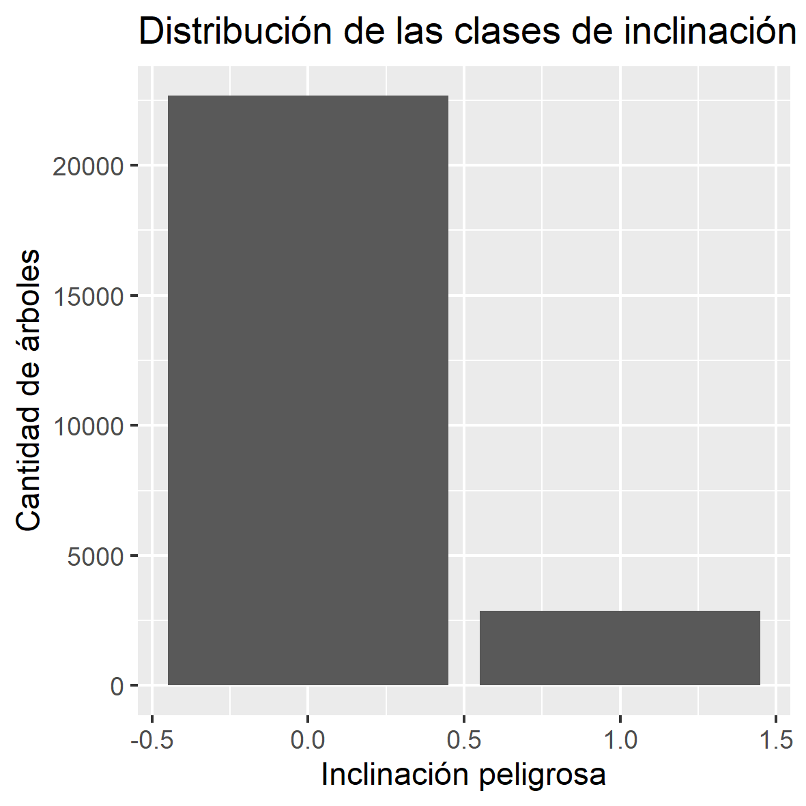
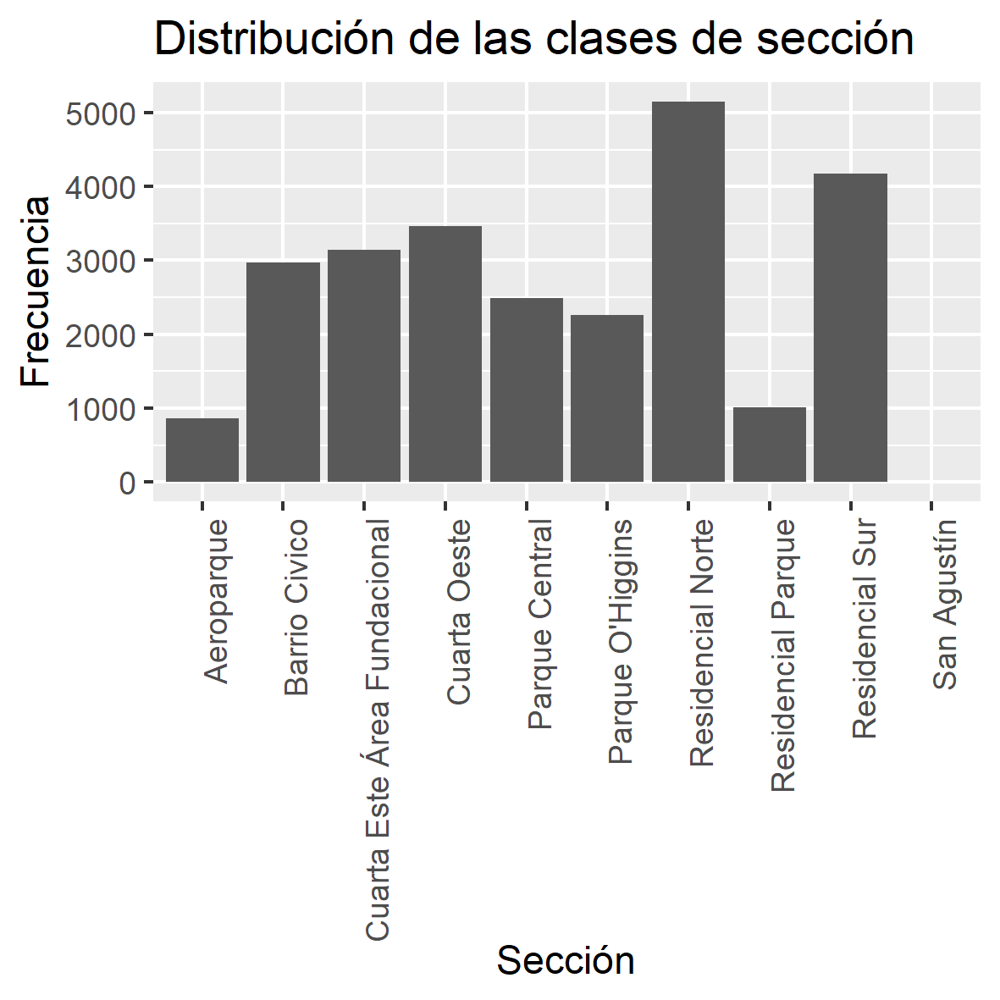
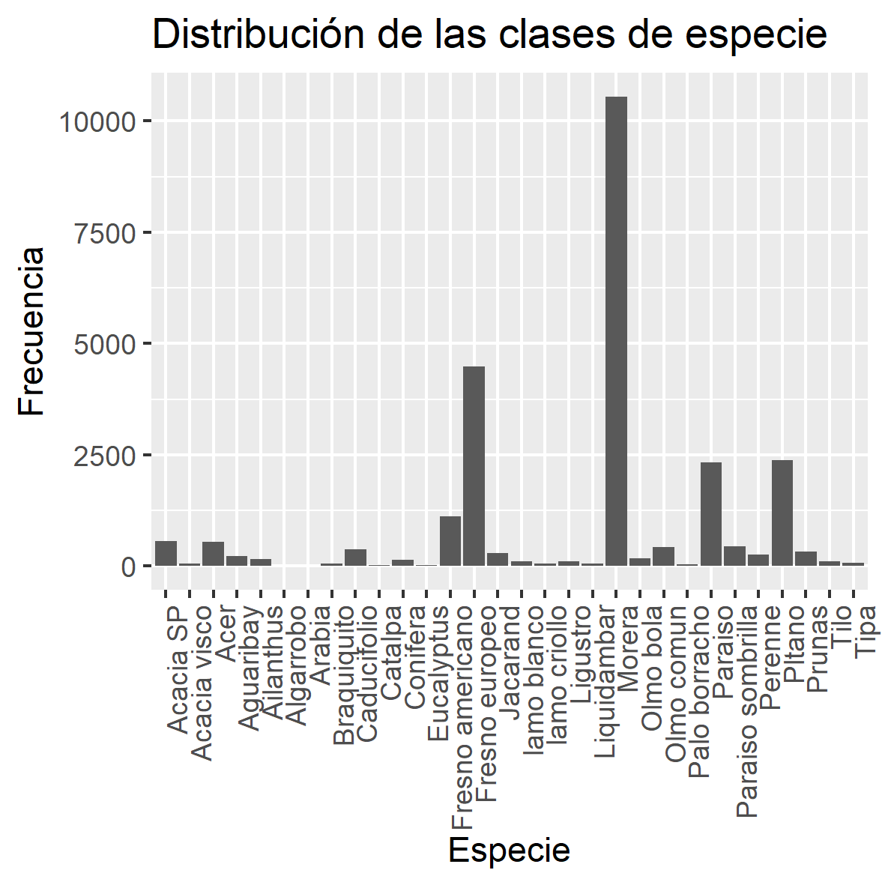
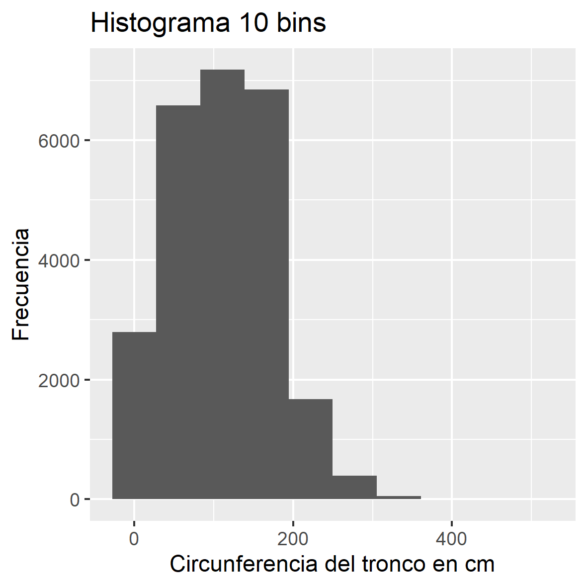
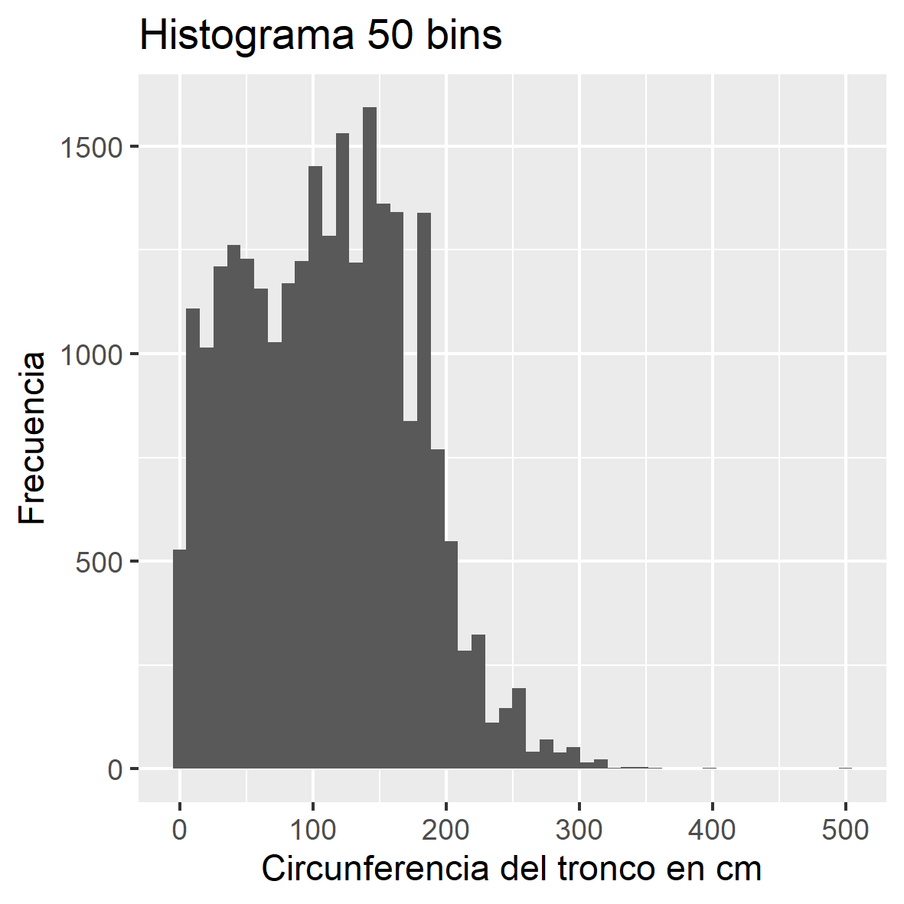
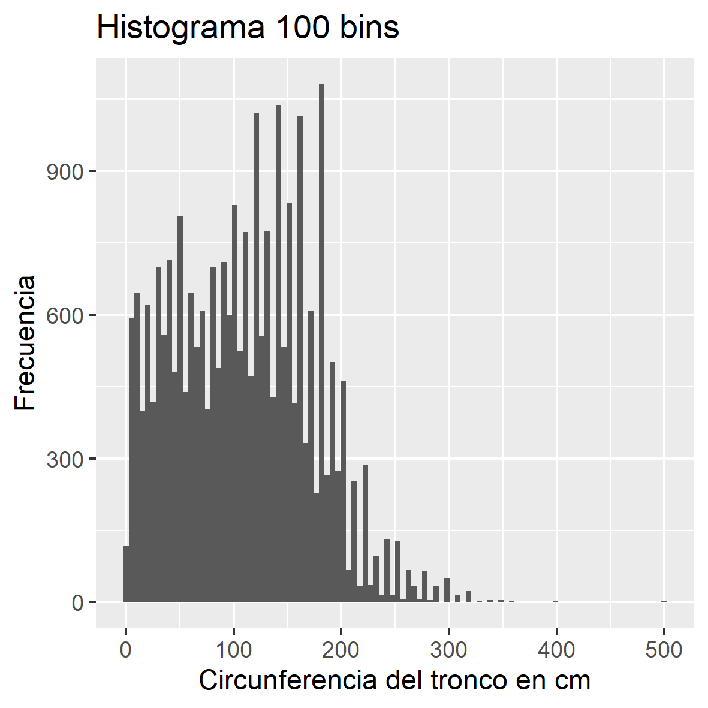

# TP7 - IA

# PARTE A

## 2. A partir del archivo arbolado-mendoza-dataset-train.csv responder las siguientes preguntas:

### a. ¿Cual es la distribución de las clase inclinacion_peligrosa?

::: {style="text-align:center"}
En el gráfico podemos observar que la clase inclinación peligrosa tiene una distribución desbalanceada, ya que la clase 0 tiene una cantidad de árboles mucho mayor que la clase 1.
:::

### b. ¿Se puede considerar alguna sección más peligrosa que otra?

::: {style="text-align:center"}
Podemos observar como Residencial Norte y Residencial Sur tienen una cantidad de árboles mucho mayor que el resto de las secciones, por lo que podemos considerar que son las secciones más peligrosas.
:::

### c.¿Se puede considerar alguna especie más peligrosa que otra?

::: {style="text-align:center"}
Podemos observar como la Morera es la especie que más árboles tiene, por lo que podemos considerar que es la especie más peligrosa.
:::

## 3. A partir del archivo arbolado-mendoza-dataset-train.csv

### a. Generar un histograma de frecuencia para la variable circ_tronco_cm. Probar con diferentes números de bins.

::: {style="text-align:center"}
El cirterio seleccionado fué dividirlo segun los cuartiles estadisticos(0, 0.25, 0.5, 0.75, 1)
:::
